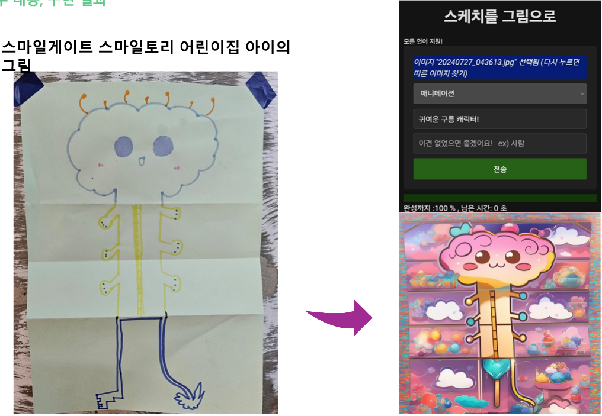

# 스케치 to 그림
## 이 프로젝트는 사용자의 요청에 따라 손쉽게 그림을 생성해주는 서비스입니다. 사용자가 제공한 텍스트 설명을 바탕으로 AI 기술을 활용하여 원하는 그림을 생성해드립니다.

## 한 줄 소개
```angular2html
단순하게 스케치 하거나, 낙서한 그림을 요청한대로 멋있게 완성해 주는 서비스입니다.
```

## 타겟 & 니즈
```angular2html
1. 그림에 대한 영감을 얻고 싶은 사람. 
2. 이미지 생성 AI를 쉽게 접근하고 싶은 사람. 
3. 자신이 그린 낙서나 스케치를 멋있게 완성하고 싶은 사람.
```

## 주요 기능
```angular2html
1. 사용자 입력 텍스트를 받아 이에 맞는 그림 생성
2. 생성된 스케치를 JPEG 이미지 파일로 제공
3. 사용자 맞춤형 스타일 및 레이아웃 옵션 제공
```

## 기술 스택
```angular2html
Python
Flask (웹 프레임워크)
Stable Diffusion (이미지 생성 AI 모델)
OpenCV (이미지 처리)
Soketio (실시간 통신)
```

## 사용 방법
```angular2html
1. QR코드나 링크를 통해 접속합니다.
2. 이미지 선택하기 버튼으로 카메라 or 갤러리에서 이미지를 선택합니다.
3. 원하는 스타일을 선택하신후 프롬프트로 요소를 추가하거나 제거합니다. ex) 귀여운 구름캐릭터
4. 완성!
```


## 시연 영상

https://youtube.com/shorts/EE1fRX1quWc?si=aRjIfXFH-FC6zD7V

## 기대 효과
```angular2html
그림이 서툰 아이들은 자신의 그림으로 만들어진  그림들을 보며 상상력을 키워갈 수 있다.

2. 예술가들은 자신이 상상하지 못한 영감을 얻을 수 있다.

3. AI 사용이 서툰 노인들도 QR 코드나 링크만 있으면 사용 가능하기 때문에 쉽게 접근하여 이미지 생성 모델을 즐길 수 있다.

4. 미술 선생님이 없어도 작품에 대한 도움을 받을 수 있다.
```

## 기여하기
```angular2html
이 프로젝트는 오픈소스로 운영되며, 누구나 참여하실 수 있습니다. 버그 수정, 새로운 기능 추가, 문서 개선 등 다양한 방식으로 기여해주시기 바랍니다.
```

## 문의 및 피드백
```angular2html
프로젝트 관련 문의 사항이나 피드백은 깃허브 이슈 트래커를 통해 남겨주시기 바랍니다.
```